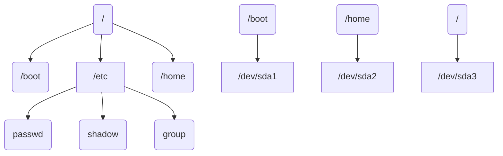

## 系统分区

### 硬件设备文件名

|       硬件        |      设备文件名      |
| :---------------: | :------------------: |
|      IDE硬件      |     /dev/hd[a-d]     |
| SCSI/SATA/USB硬盘 |     /dev/sd[a-p]     |
|       光驱        | /dev/cdrom或/dev/sr0 |
|       软盘        |     /dev/fd[0-1]     |
|  打印机（25针）   |     /dev/lp[0-2]     |
|   打印机（USB）   |  /dev/usb/lp[0-15]   |
|       鼠标        |      /dev/mouse      |

#### 必须分区

- / 根分区
- swap分区（交换分区，内存2倍，不超过2GB）

#### 推荐分区

- /boot （启动分区，200MB）

#### 文件系统结构

**boot目录和home目录是根目录的子目录但却有独立的硬盘空间**

## Linux各级目录的作用

|      目录名      | 目录作用                                                     |
| :--------------: | :----------------------------------------------------------- |
|    **/bin/**     | 存放系统命令的目录，普通用户和超级用户都可以执行。不过放在/bin下的命令在单用户模式下也可以执行 |
|    **/sbin/**    | 保存和系统环境设置相关的命令，只用超级用户可以使用这些命令进行系统环境设置，但是有些命令可以允许普通用户查看 |
|  **/user/bin**   | 存放系统命令的目录，普通用户和超级用户都可以执行。这些命令和系统启动无关，在单用户模式下不能执行 |
| **/user/sbin/**  | 存放根文件系统不必要的系统管理命令，例如多数服务程序。只有超级用户可以使用。大家其实可以注意到**Linux**的系统，在所有“**sbin**”目录中保存的命令只有超级用户可以使用，“**bin**”目录中保存的命令所有用户都可以使用 |
|    **/boot/**    | 系统启动目录，保存系统启动相关的文件，如内核文件和启动引导程序（grub）文件等 |
|    **/dev/**     | 设备文件保存位置。**Linux**中所有内容以文件形式保存，包括硬件。那么这个目录就是用来保存所有硬件设备文件的 |
|    **/etc/**     | 配置文件保存位置。系统内所有采用默认安装方式（rpm安装）的服务的配置文件全都保存在这个目录中，如用户账号和密码，服务的启动脚本，常用服务的配置文件 |
|    **/home/**    | 普通用户的家目录，建立每个用户时，每个用户要有一个默认登录设置，这个位置就是这个用户的家目录，所有普通用户的家目录就是在**/home**下建立一个和用户名相同的目录。 |
|    **/lib/**     | 系统调用的函数库保存位置                                     |
| **/lost+found/** | 当系统意外崩溃或机器意外关机，而产生一些文件碎片放在这里。当系统启动的过程中fsck工具会检查这里，并修复已经损坏的文件系统。这个目录只在每个分区中出现，例如**/lost+found/**就是根分区的备份恢复目录，**/boot/lost+found**就是**/boot**分区的备份恢复目录 |
|    **/misc/**    | 挂载目录。系统建议用来挂载**NFS**服务的共享目录。只要是一个已经建立的空目录就可以作为挂载点。那么系统虽然准备了三个默认挂载目录/media、/mnt、/misc，但是到底在哪个目录中挂载什么设备都可以由管理员自己决定。 |
|   **/media/**    | 挂载目录。系统建议是是用来挂载媒体设备的，例如软盘和光盘录。 |
|    **/mnt/**     | 挂载目录，早期Linux中只有这- 一个挂载目录，并没有细分。现在这个目录系统建议挂载额外设备，如U盘，移动硬盘和其他操作系统的分区。 |
|    **/opt/**     | 第三方安装的软件保存位置。这个目录就是放置和安装其他软件的位置，我手工安装的源码包软件都可以安装到这个目录当中。不过我还是更加习惯把软件放置到/usr/local/目录当中，也就是说/usr/local/目录也可以用来安装软件 |
|    **/proc/**    | 虚拟文件系统，该目录中的数据并不保存到硬盘当中，而是保存到内存当中。主要保存系统的内核，进程，外部设备状态和网络状态灯。如/proc/cpuinfo是保存CPU信息的，/proc/devices是 保存设备驱动的列表的，/proc/filesystems是保存文件系统列表的，/proc/net/是 保存网络协议信息的 |
|    **/sys/**     | 虚拟文件系统。和/proc目录相似，都是保存在内存当中的，主要是保存于内核相关信息的 |
|    **/root/**    | 超级用户的家目录。普通用户家目录在“home”下，超级用于家目录直接在“/”下 |
|    **/srv/**     | 服务数据目录。一些系统服务启动之后，可以在这个目录中保存所需要的数据 |
|    **/tmp/**     | 临时目录。系统存放临时文件的目录，该目录下所有用户都可以访问和写入。我们建议此目录中不能保存重要数据，最好每次开机都把该目录清空 |
|    **/usr/**     | 系统软件资源目录。注意usr不是user的缩写，而是“Unix SoftwreResource”的缩写，所以不是存放用户数据，而是存放系统软件资源的目录。系统中安装的软件大多数保存在这里，所以除了/usr/bin/和/usr/sbin/这两个目录，我在介绍几个/usr/下的二级目录 |
|    **/var/**     | 动态数据保存位置。主要保存缓存、日志以及软件运行所产生的文件 |

